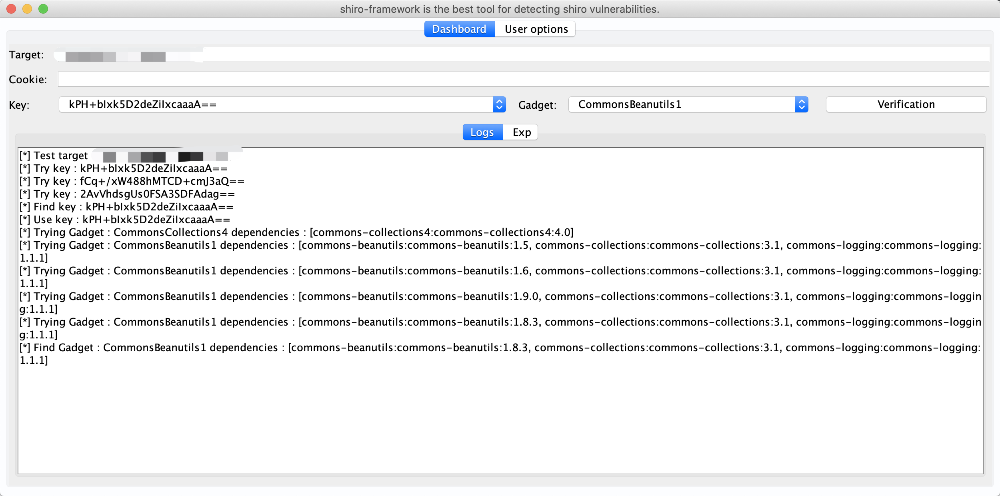
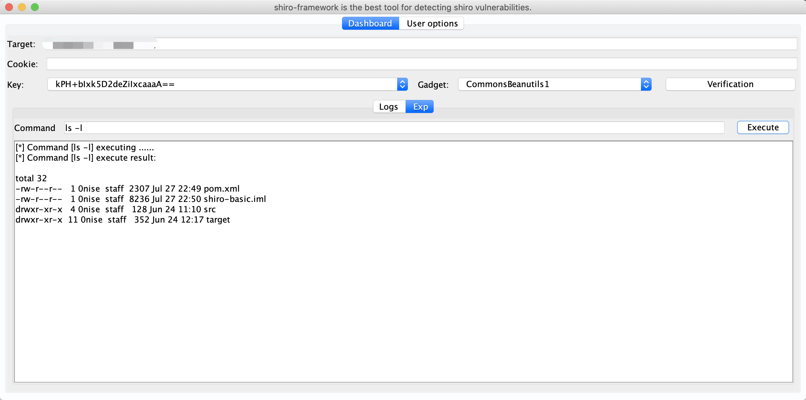

## shiro-framework

shiro-framkework is the best tool for detecting shiro vulnerabilities.


## 免责申明

**本工具仅适用于安全技术研究，严禁使用本工具发起网络黑客攻击，造成的法律后果，请使用者自负。**

## 用法

1. 设置检测目标



2. 执行验证



配置代理，设置 `config/config.yml` 中 `proxy` 节点：

```
proxy: 
  protocol: http
  host: 127.0.0.1
  port: 8080
```


## 更新日志

### v0.1.2

更新时间：2020-09-30
- 删除默认代理配置
- 删除配置中心

### v0.1.1

更新时间：2020-07-27
- 新增不出网检测 key
- 新增不出网利用 Gadget
- 新增依赖版本算法